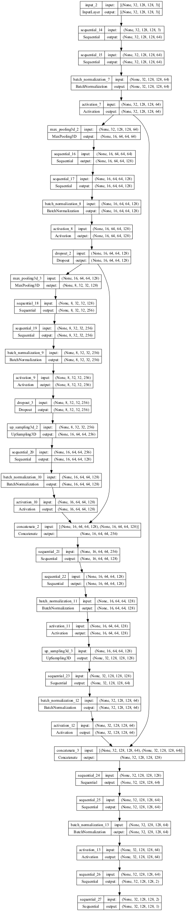

# ViSeNet (Video Segmentation Network)

This is the video-based segmentation network, based on the [U-Net](https://github.com/zhixuhao/unet) and the [V-Net](https://arxiv.org/abs/1606.04797). Can also theorhetically work with 3d segmentaiton like V-Net.

## Architecture

The network architecture can be seen below:

It consists of a variable depth of convolution, which is unique - most implementations of segmentation networks are not flexible. The image above is of a model with depth 3.

Downwards steps consist of 3D convolution, followed by batch normalization, activation, and 3D pooling. Upwards steps consist of 3D upsampling, convolution, normalization, activation, concatenation, convolution, normalization, and activation again. 

## Training

A model was trained using [DAVIS](https://graphics.ethz.ch/~perazzif/davis/index.html) data as a proof-of-concept, but the dataset is likely too variable for these purposes. For example, a more specific thing, like vehicle, cell, or animal segmentation in particular would likely yield better results.